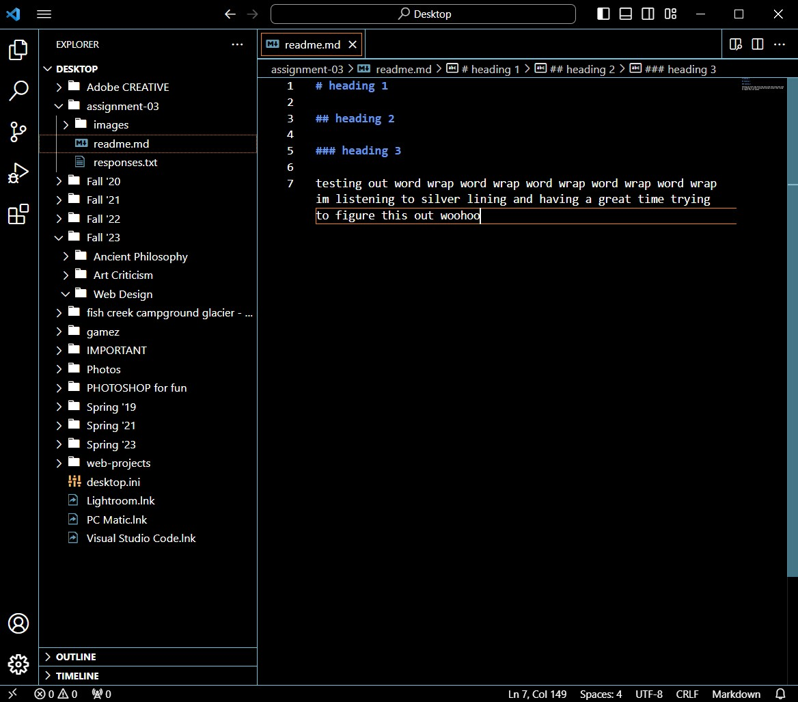
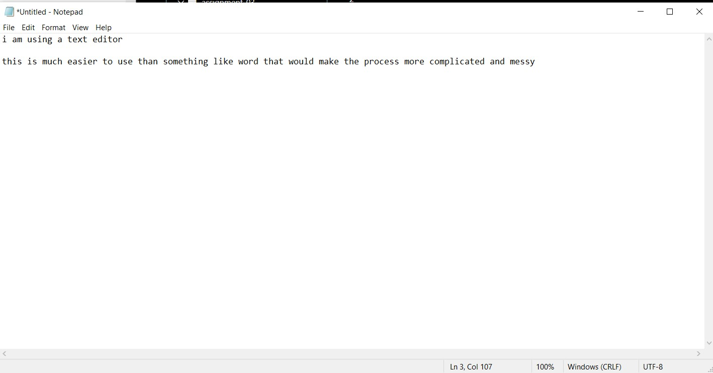

# heading 1

## heading 2

### heading 3

testing out word wrap word wrap word wrap word wrap word wrap im listening to silver lining and having a great time trying to figure this out woohoo

[abramovic](https://www.royalacademy.org.uk/exhibition/marina-abramovic)

[my file](./responses.txt)

[responses](./responses.txt)
